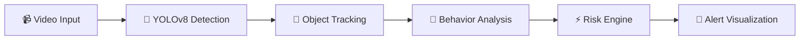

# 🔍 AI Behavioral Surveillance Platform

### MVP Documentation — Team Enclope

---

## 📌 Problem Statement

Traditional CCTV systems rely heavily on human monitoring, which is **inconsistent and inefficient**. There is no automated behavioral intelligence, risk scoring, or customizable restricted zone monitoring.

## 💡 Proposed Solution

We developed a **real-time AI-powered behavioral surveillance system** capable of:

- Detecting people in video feeds
- Tracking them across frames
- Analyzing motion behavior
- Identifying restricted zone breaches
- Generating cumulative risk scores with automated alerts

---

## ✅ Core Implemented Features (MVP)

| Feature | Description |
|---|---|
| 🎯 Person Detection | YOLOv8-based real-time person detection |
| 🔗 Multi-Object Tracking | Centroid-based tracking with persistent identity across frames |
| 🧠 Behavioral Analysis | Loitering detection & fast movement classification |
| 🚧 Restricted Zone Detection | Custom drawable zones with multi-zone support |
| ⚡ Risk Scoring Engine | Cumulative risk scoring per tracked individual |
| 🚨 Visual Alert System | Green/Red bounding boxes based on risk level |
| 📁 Dual Input Modes | Upload pre-recorded footage or use live webcam |
| 📊 Live Dashboard Metrics | Real-time analytics for alerts, zone breaches, and risk |
| ✏️ Manual Restricted Zone Entry | Draw zones directly on the video frame |
| 🎛️ Adjustable Sensitivity Controls | Tune risk and speed thresholds on-the-fly |

---

## 🏗️ System Architecture

```
Video Input → YOLOv8 Detection → Object Tracking → Behavior Analysis → Risk Engine → Alert Visualization Layer
```



---

## 🛠️ Technical Stack

| Technology | Purpose |
|---|---|
| **Python** | Core programming language |
| **YOLOv8 (Ultralytics)** | Deep learning object detection |
| **OpenCV** | Video processing & frame manipulation |
| **Streamlit** | Interactive web dashboard |
| **Custom Logic** | Tracking, behavior analysis & risk engine |

---

## 📂 Project Structure

```
PS-2/
├── app.py                # Core application controller & video pipeline
├── detector.py           # YOLOv8 person detection module
├── tracker.py            # Centroid-based multi-object tracker
├── behavior.py           # Behavioral analysis (loitering & fast movement)
├── risk_engine.py        # Cumulative risk scoring engine
├── utils.py              # Shared utilities (logging, geometry, frame tools)
├── streamlit_app.py      # Streamlit web dashboard
├── requirements.txt      # Python dependencies
├── yolov8n.pt            # Pre-trained YOLOv8 nano weights
└── sample_video.mp4      # Sample test video
```

---

## 🚀 Getting Started

### Prerequisites

- Python 3.9+
- pip

### Installation

```bash
# Clone the repository
git clone https://github.com/rajatbhardwaz/PS-2-CCTV-Monitoring-System.git
cd PS-2-CCTV-Monitoring-System

# Install dependencies
pip install -r requirements.txt
```

### Running the Dashboard

```bash
streamlit run streamlit_app.py
```

Open **http://localhost:8501** in your browser.

### CLI Batch Processing

```bash
python app.py
```

Processes `sample_video.mp4` → `output_video.mp4` and prints a summary.

---

## 📊 Dashboard Capabilities

- **Real-time video rendering** with annotated bounding boxes
- **Risk score monitoring** per tracked individual
- **Alert tracking** with cumulative event logging
- **Zone breach detection** with visual overlay
- **Start / Stop / Reset controls** for session management
- **Sensitivity adjustment** via threshold sliders
- **CSV export** of full session tracking data

---

## 🧪 Testing

### Upload Video Mode

1. Open http://localhost:8501
2. Click **Start Monitoring →** → **Select Upload**
3. Upload an MP4 video
4. Optionally draw restricted zones on the preview
5. Click **🚀 Process Video**
6. Download the annotated output

### Live Camera Mode

1. Click **Select Camera** from mode selection
2. Capture a frame → draw restricted zones
3. Click **▶ Start** for real-time monitoring
4. Adjust sensitivity sliders as needed

### Module-Level Testing

```python
from detector import ObjectDetector
from tracker import ObjectTracker
from behavior import BehaviorAnalyzer
from risk_engine import RiskEngine

# Detection
detector = ObjectDetector("yolov8n.pt")
detections = detector.detect(frame)

# Tracking
tracker = ObjectTracker()
tracks = tracker.update(detections)

# Behavior Analysis
analyzer = BehaviorAnalyzer()
behaviors = analyzer.analyze(tracks, frame_index=0)

# Risk Scoring
engine = RiskEngine(threshold=30)
risks = engine.evaluate(behaviors)
```

---

## 🏁 Conclusion

The MVP successfully demonstrates **intelligent real-time surveillance** with behavioral analysis, dynamic risk scoring, and customizable restricted zone monitoring. It proves feasibility for **smart automated security systems**.

---

<p align="center">
  <b>Built with ❤️ by Team Enclope</b>
</p>
